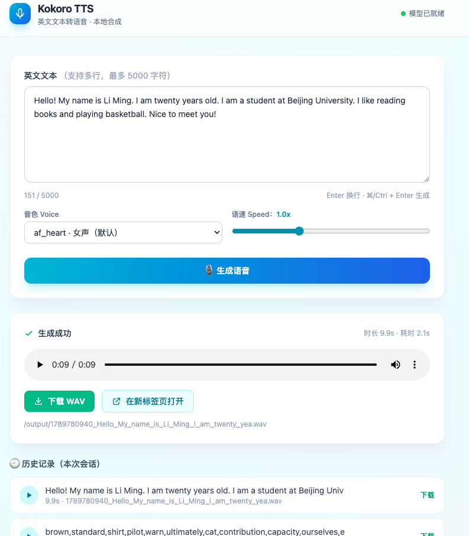

# Kokoro TTS Web

英文文本 → 语音合成（Kokoro-82M 本地推理）→ 返回可点击下载的 WAV 链接。



## 结构

```
web/
├── app.py              # Flask 后端（API + 静态托管）
├── static/
│   └── index.html      # 静态前端（TailwindCSS CDN）
├── output/             # 生成的音频文件
├── crontab.sh          # 守护脚本（端口监控 + 自动拉起）
├── speech_text.py      # 命令行批量合成示例脚本
├── requirements.txt    # Python 依赖
├── example.png         # 界面截图
└── README.md
```

## 安装

```bash
# 创建 conda 环境（Python 3.11）
conda create -n kokoro python=3.11 -y
conda activate kokoro

# 安装依赖（含 spaCy 英文模型）
pip install -r requirements.txt

# 系统依赖：ffmpeg（语速调节用）
brew install ffmpeg   # macOS
```

## 启动

```bash
conda activate kokoro
cd <项目目录>
python app.py
```

打开 http://localhost:7860

## API

| 方法 | 路径 | 说明 |
|------|------|------|
| GET  | `/` | 前端页面 |
| POST | `/api/tts` | `{ "text": "...", "voice": "af_heart", "speed": 1.0 }` → `{ success, url, download_url, duration, elapsed }` |
| GET  | `/output/<file>` | 播放音频；加 `?download=1` 触发下载 |
| GET  | `/api/health` | 健康检查 |

## 特性

- ✅ 静态页面 + TailwindCSS（CDN，零构建）
- ✅ 音色 / 语速可选
- ✅ 生成后内嵌播放器 + 下载链接
- ✅ 会话内历史记录
- ✅ ⌘/Ctrl + Enter 快捷生成
- ✅ 响应式 + 无障碍（aria-live、role、键盘可达）

## 守护运行（crontab.sh）

```bash
# 手动运行（默认端口 7860）
./crontab.sh

# 指定端口
./crontab.sh -p 8000

# 指定端口 + 日志文件
./crontab.sh -p 8000 -l /tmp/tts.log

# crontab 每 5 分钟检测一次，端口挂了自动拉起
# 路径请替换为你的项目目录
*/5 * * * * /path/to/kokoro-tts-web/crontab.sh >> /path/to/kokoro-tts-web/crontab.log 2>&1
```

脚本逻辑：
1. 检测端口是否在监听（`lsof`），在运行则直接退出
2. 未运行则激活 `kokoro` conda 环境，以 `PORT` 环境变量后台启动 `app.py`
3. 启动后等待端口就绪，失败自动重试（最多 3 次）

## License

[MIT](LICENSE)
